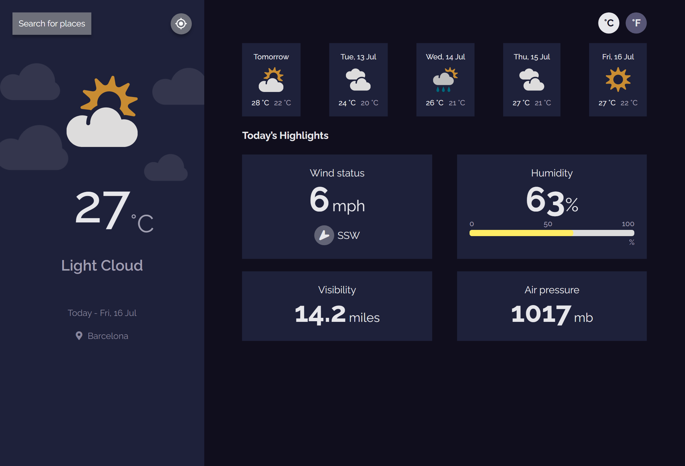

<h1 align="center">{Weather App}</h1>

  <h3>
    <a href="https://{your-demo-link.your-domain}">
      Live Demo
    </a>
     | 
    <a href="https://devchallenges.io/challenges/mM1UIenRhK808W8qmLWv">
      Challenge
    </a>
  </h3>

## Table of Contents

- [Overview](#overview)
  - [Built With](#built-with)
- [Features](#features)
- [How to use](#how-to-use)
- [Contact](#contact)

## Overview

Weather app build with vanilla JavaScript using Meta Weather API. In this project I learned how to convert temperature in Celcius to Fahrenheit, writing progress bar, using Gelocation API by google (for getting current location of user), how to add favicon to HTML file, getting different date of day using Date object, using async await structure with fetch API and so on. 

- You can check live demo here

### Built With

- HTML
- pure CSS
- JavaScript
- Meta Weather API
- AJAX, async await
- DOM manipulation
- Geolocation API for current location
- Date object
- Pretty much everything

## Features

User can see city weather as default, preferably my current location
User can search for city
User can see weather of today and the next 5 days
User can see the date and location of the weather
User can see according to image for each type of weather
User can see the min and max degree each day
User can see wind status and wind direction
User can see humidity percentage
User can see a visibility indicator
User can see the air pressure number
User can request my current location weather
User can convert temperature in Celcius to Fahrenheit and vice versa

## How To Use

To clone and run this application, you'll need [Git](https://git-scm.com). That it :)

## Contact

- GitHub [@anarseferrov](https://{github.com/anarseferrov})
